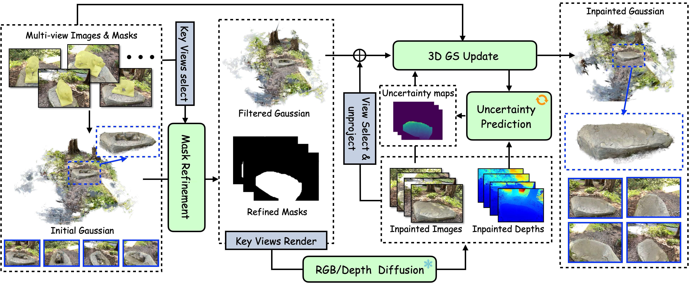

# HF-GS

Title: High-fidelity 3D Gaussian Inpainting: preserving multi-view consistency and photorealistic details.


## Installation
Install with `conda`: 
```bash
conda env create -f environment.yaml
conda activate hf-gs
```
* If the installation of torch fails, please refer to the [PyTorch official website](https://pytorch.org/get-started/previous-versions/) and run this line of code: `pip install torch==2.1.2 torchvision==0.16.2 torchaudio==2.1.2 --index-url https://download.pytorch.org/whl/cu118`
* The `simple-knn` and `diff-gaussian-rasterization-confidence` packages in the `gaussian_splatting/submodules` directory are obtained by referencing [Infusion](https://github.com/ali-vilab/Infusion)
* If the two packages, `simple-knn` and `diff-gaussian-rasterization-confidence`, fail to download and install successfully, please download them manually according to the `download_install.sh` script.
## Download Checkpoints
Download checkpoint and put it in the 'checkpoints' folder: 
* [Infusion HuggingFace](https://huggingface.co/Johanan0528/Infusion/tree/main)
* Stable Diffusion (Choose one that you think works well. Here we provide the results of SD. The runthrough example does not need to be downloaded)

Download LaMa and big-lama. Refer to the link: [LaMa](https://github.com/advimman/lama)

**Note:** We have two python files in the lama directory used for data preparation

**Alternatively, you can simply run the command below to download and install. If it fails, you can refer to the other download methods provided in this file.**
```bash
bash download_install.sh
```

## Data Preparation

We have provided two scene [data](https://drive.google.com/drive/folders/1aUuvNQZvUwt93CfFBg_ZT2E8Uz_AfC9h?usp=drive_link) examples, packaged together, which include ground truth (GT) images, segmented masks, and viewpoint information. (The acquisition of this information refers to [Infusion](https://github.com/ali-vilab/Infusion))

You have downloaded it by running `download_install.sh`. The result of unzipping in the main directory of hs-gs is: 

```text
data
├── Mip-NeRF
│   └── colmap_dir
│       └── garden
│           ├── images
│           ├── seg
│           └── sparse
│               └── 0
└── SPIn-NeRF
    └── colmap_dir
        └── 9
            ├── images
            ├── seg
            └── sparse
                └── 0
```

- **Note:** Due to the uncertainty of stable diffusion, we provide the repair results for the example.

* If gdown download fails, you can click this [link](https://drive.google.com/drive/folders/1aUuvNQZvUwt93CfFBg_ZT2E8Uz_AfC9h?usp=drive_link) to download it manually. (or download the [data.zip](https://drive.google.com/file/d/1o-YDSlHmO6NALXhmLVxB4XYkc6H78rXE/view?usp=drive_link))

## Instructions

We provide two example processes. One is the process of using Lama to repair the spinnerf dataset, and the other is the process of using stable diffusion to repair the Mip-NeRF dataset. Select one of the following to execute:

lama:

```bash
bash run_lama.sh
```

sd:

```bash
bash run_sd.sh  # todo
```

The results of the final picture display are under test or train in the scene directory `/output/[dataset]/[scene]`.

